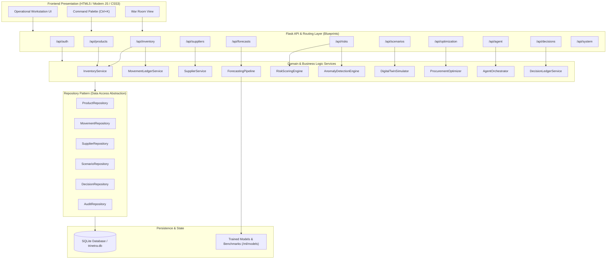
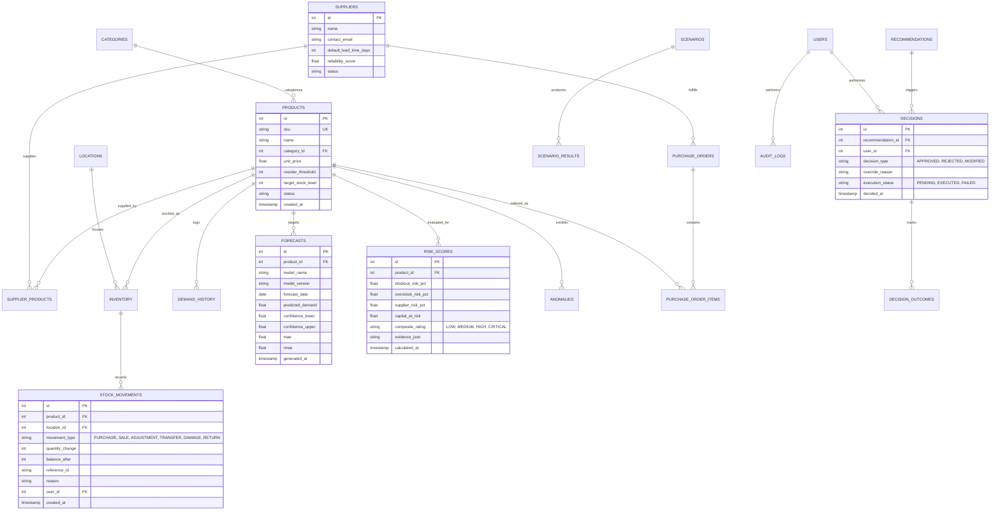
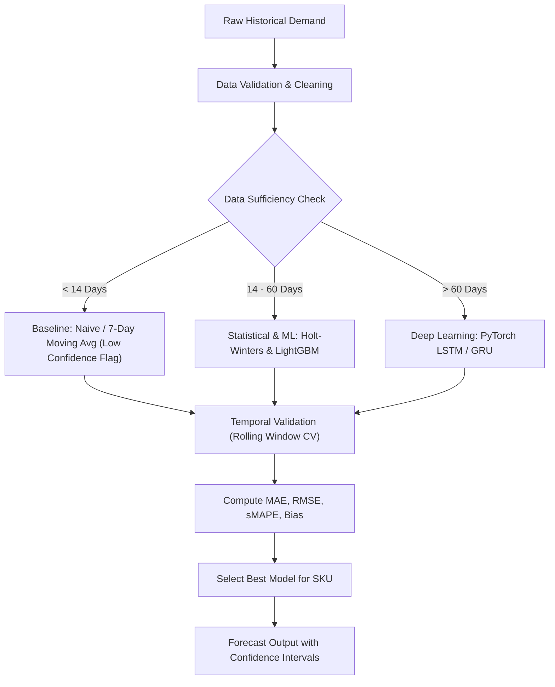
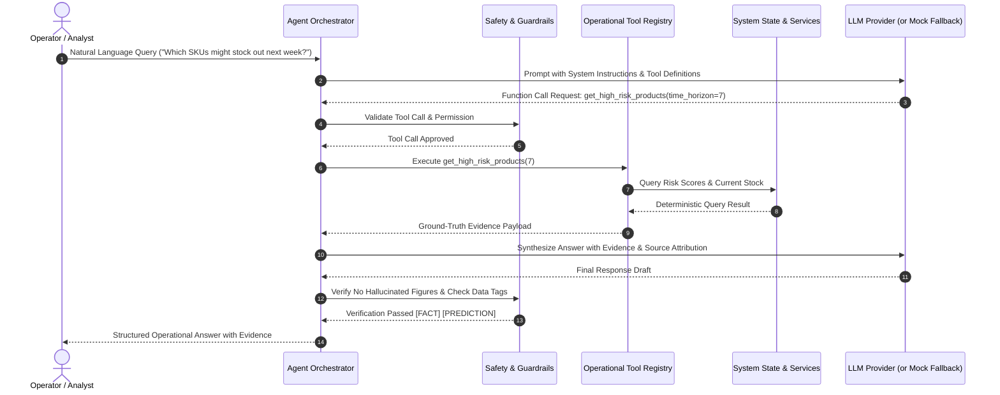
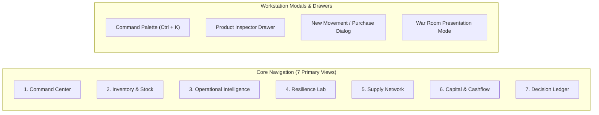
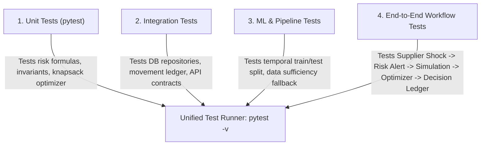

# TRINETRA — Master Architecture Review & Engineering Blueprint
**AI-Native Inventory Resilience & Decision Intelligence Platform**  
*Tagline: SEE. FORESEE. PREPARE.*

---

## 1. Final Understanding & System Vision

### The Paradigm Shift
Traditional Inventory Management Systems (IMS) are passive recording tools. They answer only one question after the fact: **"What do we have in stock right now?"** When an item runs out or a supplier fails, traditional systems report the disaster only after it has already caused revenue loss and operational disruption.

**TRINETRA** changes the paradigm from reactive ledger accounting to **anticipatory resilience intelligence**. It operates on a continuous feedback loop:

$$\text{OBSERVE} \longrightarrow \text{UNDERSTAND} \longrightarrow \text{FORECAST} \longrightarrow \text{DETECT RISK} \longrightarrow \text{SIMULATE} \longrightarrow \text{OPTIMIZE} \longrightarrow \text{RECOMMEND} \longrightarrow \text{HUMAN DECISION} \longrightarrow \text{EXECUTE} \longrightarrow \text{MEASURE} \longrightarrow \text{LEARN}$$

### The Three Eyes of TRINETRA
1. **EYE 1 — SEE (The Present Operational State):** Real-time stock levels, movement velocity, active suppliers, purchase orders, storage locations, tied-up capital, and real-time operational anomalies.
2. **EYE 2 — FORESEE (The Probabilistic Future):** Multi-model demand forecasting (baselines, machine learning, and sequence deep learning), lead-time variance tracking, stockout probability curves, overstock exposure, and supplier concentration risk.
3. **EYE 3 — PREPARE (Resilience & Action):** Digital twin scenario simulation (what-if shocks), constrained procurement optimization (budget allocation), alternate supplier routing, explainable recommendations, human-in-the-loop decision ledger, and counterfactual replay.

---

## 2. Problem Statement & Operational Context

Modern supply networks and retail operations suffer from four systemic vulnerabilities:
1. **Blind Demand Spikes & Stockouts:** Sudden consumer demand shifts exhaust safety buffers before reorders can be fulfilled, resulting in lost sales and customer churn.
2. **Supplier Single-Point-of-Failure (SPOF):** Heavy reliance on single vendors with unmonitored lead-time degradation causes cascading supply shortages.
3. **Dead Capital Accumulation:** Over-ordering slow-moving inventory ties up working capital that could otherwise be deployed into high-velocity goods.
4. **Disjointed Decision-Making:** Operators either rely on gut feeling or black-box predictions that lack explainability, actionable mitigation options, or auditable outcome tracking.

**TRINETRA** eliminates these gaps by unifying predictive models with a simulation sandbox and a constrained optimization engine, placing a human decision-maker at the center of every critical action.

---

## 3. Target Users & Personas

| Persona | Primary Needs & Pain Points | TRINETRA Touchpoint |
| :--- | :--- | :--- |
| **Inventory Manager** | Needs day-to-day stock health visibility, low-stock warnings before stockouts occur, and auditable movement tracking. | Command Center, Inventory Explorer, Stock Movement Ledger |
| **Procurement & Supply Chain Lead** | Manages supplier performance, lead-time delays, supply concentration risks, and optimal reorder quantities within fixed budgets. | Supplier Intelligence, Constrained Procurement Optimizer, Supply Network Graph |
| **Financial Analyst / COO** | Needs visibility into capital exposure, dead stock, inventory turnover velocity, and projected revenue at risk. | Capital Intelligence, Decision Ledger, Resilience Index |
| **Operations Commander / Planner** | Evaluates emergency disruptions ("What if Supplier X fails for 14 days?"), runs what-if simulations, and formulates recovery playbooks. | Resilience Lab (Digital Twin), War Room Mode, Counterfactual Replay |

---

## 4. Complete Feature Map

```
TRINETRA
├── 1. Command Center (Operational Landing)
│   ├── Inventory Pulse (Health score, total value, stockout exposure, dead capital)
│   ├── Attention Queue (Ranked actionable alerts with evidence)
│   ├── Future Horizon Window (NOW / 7-Day / 30-Day projections)
│   └── Daily Operational Brief (Evidence-backed operational narrative)
├── 2. Core Inventory & Movement Ledger
│   ├── Product & Category Management (CRUD with non-negative constraints)
│   ├── Warehouse & Multi-Location Stock Tracking
│   └── Immutable Movement Engine (Purchase, Sale, Adjustment, Transfer, Damage, Expiry)
├── 3. Inventory DNA & Behavioral Profiling
│   ├── Automated Profiling (Velocity, Volatility, Turnover, Lead-time Sensitivity)
│   └── Behavioral Classifications (FAST MOVER, SLOW MOVER, VOLATILE, SEASONAL, CRITICAL)
├── 4. Supplier Intelligence & Network Graph
│   ├── Supplier Performance (Historical lead time, reliability rate, failure rate)
│   ├── Single Point of Failure (SPOF) & Concentration Risk Analysis
│   └── Interactive Supply Network Graph (Supplier → Product → Location → Revenue Exposure)
├── 5. Forecasting Engine & Benchmarking Suite
│   ├── Benchmark Models: Naive, Moving Average, Exp Smoothing, ARIMA, LightGBM, LSTM/GRU
│   ├── Time-Series Validation (Rolling window, zero future leakage)
│   ├── Data Sufficiency Gatekeeper (Prevents fake predictions on sparse data)
│   └── Forecast Output (Point estimates, prediction intervals, error metrics: MAE, RMSE, sMAPE)
├── 6. Transparent Risk & Anomaly Engine
│   ├── 8-Dimension Risk Matrix (Stockout, Overstock, Dead Stock, Supplier, Spike, Collapse, Capital, Lead Time)
│   ├── Anomaly Detection (Z-Score, IQR, Rolling Residuals, Isolation Forest)
│   └── TRINETRA Resilience Index (Composite resilience score with exposed formula)
├── 7. Resilience Lab & Digital Twin Sandbox
│   ├── In-Memory Sandbox (Zero real-DB mutations during simulation)
│   ├── Shock Generators (Demand +X%, Supplier down N days, Lead time 2x, Budget -30%)
│   ├── Mitigation Comparison (Emergency reorder vs Supplier switch vs Warehouse transfer)
│   └── Counterfactual Replay ("What if we had ordered 100 units 14 days earlier?")
├── 8. Constrained Procurement Optimizer
│   ├── Budget-Constrained Multi-Product Allocation (Knapsack / Greedy / Linear Optimization)
│   └── Emergency Triage Mode (Prioritizing critical SKUs and revenue protection)
├── 9. Explainable AI & Decision Ledger
│   ├── Structured Recommendations (WHAT, WHY, EVIDENCE, CONFIDENCE, RISK, ALTERNATIVES)
│   ├── Human-in-the-Loop Actions (Approve, Reject, Modify, Record Override Reason)
│   └── Decision Outcome Tracker (Comparing recommendation vs decision vs actual result)
├── 10. Governed AI Operations Agent
│   ├── Natural Language Query Interface (Strict tool-calling orchestrator)
│   ├── Strict Tool Schemas (get_product, run_scenario, optimize_budget, get_forecast, etc.)
│   ├── AI Safety & Guardrails (Explicit tags: FACT vs PREDICTION vs SIMULATION)
│   └── Pluggable LLM Provider (External API / Mock deterministic offline fallback)
└── 11. Command Workstation & Presentation UX
    ├── Command Palette (Ctrl+K quick actions)
    ├── War Room Presentation Mode (Incident drill-down)
    └── Export & Audit Reports (CSV and PDF exports, system health & latency telemetry)
```

---

## 5. Architectural Proposal: The Modular Monolith

To satisfy college deployment simplicity (single-process run via Python Flask + SQLite/Postgres) while adhering to enterprise engineering standards, TRINETRA is architected as a **Modular Monolith** with clean domain boundary separation.



### Architectural Highlights
- **Repository Pattern:** Database interactions are isolated behind repository interfaces (`backend/repositories/`). The business services never write raw SQL. This enables switching from SQLite to PostgreSQL without modifying a single line of business logic.
- **Service Isolation:** Business rules (stock depletion, risk formulas, optimization algorithms) reside strictly in `backend/services/`.
- **Stateless Controllers:** Flask route handlers validate incoming requests, invoke services, and return standard JSON envelopes.

---

## 6. Database Entity Map & Schema Design



### Table Definitions & Invariants
1. `products`: Core catalogue. Enforces `unit_price >= 0`, `reorder_threshold >= 0`.
2. `locations`: Warehouses and fulfilment centres.
3. `inventory`: Product quantity at a specific location. Enforces `quantity >= 0`.
4. `stock_movements`: **The immutable movement ledger**. Every inventory update MUST write a movement record. Enforces `balance_after >= 0`. Direct mutation of inventory without an audit row is structurally disallowed.
5. `suppliers` & `supplier_products`: Multiple-supplier mapping with lead time, unit cost, minimum order quantity (MOQ), and reliability metrics.
6. `demand_history`: Historical daily/weekly consumption with flag for synthetic vs real data.
7. `forecasts` & `forecast_metrics`: Versioned time-series predictions with confidence intervals and backtesting error metrics.
8. `risk_scores` & `anomalies`: Multi-dimensional risk ratings and detected operational outliers with supporting evidence.
9. `scenarios` & `scenario_results`: Snapshot-based simulation state and impact projections (isolated from live operational tables).
10. `recommendations`, `decisions`, `decision_outcomes`: The complete decision intelligence loop tracking recommendation creation, human approval/rejection/modification, and measured real-world outcome.
11. `audit_logs`: User activity tracking (WHO, WHAT, WHEN, BEFORE, AFTER, WHY).

---

## 7. Machine Learning & Deep Learning Architecture

### Forecasting Engine
TRINETRA implements a formal benchmarking pipeline rather than jumping directly to complex neural networks without baseline verification:



### Model Candidates
1. **Naive & Seasonal Naive:** Baseline benchmark ($y_t = y_{t-7}$).
2. **Moving Average & Exponential Smoothing (Holt-Winters):** Handles level and additive/multiplicative seasonality.
3. **Tree-Based Machine Learning (LightGBM / XGBoost / Random Forest):**
   - *Features:* Lag 1, 7, 14, 28; Rolling means (7d, 14d, 30d); Rolling standard deviation; Day-of-week; Month; Promotional flags.
4. **Deep Learning (PyTorch LSTM / GRU):**
   - *Architecture:* 2-layer LSTM/GRU with hidden dimension 64, dropout 0.2, dense projection head.
   - *Sequence Length:* 14–30 time steps input $\to$ 7–14 time steps multi-step output forecast.
   - *Training Protocol:* Temporal train/validation split (no shuffling, zero future lookahead), Early Stopping on validation MAE.
   - *Fallback:* If PyTorch is unavailable or training fails, the pipeline automatically falls back to LightGBM or Exponential Smoothing with zero downtime.

### Data Sufficiency & Anti-Hallucination Policy
- Models declare an explicit `data_confidence` score (0% to 100%).
- If historical observations are fewer than 14 data points, deep learning is prohibited; the system states: *"Insufficient historical data (N=X, minimum required=60). Fallback to Moving Average applied."*

---

## 8. AI Operations Agent Architecture

Rather than a generic chatbot that makes up numbers, TRINETRA implements a **Controlled Tool-Using Operations Agent**:



### Strict Tool Registry
- `search_inventory(query, category, status)`
- `get_product_dna(product_id)`
- `get_stockout_predictions(horizon_days)`
- `get_supplier_concentration_risk()`
- `run_what_if_scenario(scenario_parameters)`
- `optimize_procurement_allocation(budget_inr)`
- `get_decision_history(product_id)`

### Safety & Grounding Guardrails
- **Semantic Tagging:** Every statement must distinguish:
  - `[FACT]` — Grounded in database records (e.g. current stock: 42 units).
  - `[PREDICTION]` — Statistical model projection (e.g. expected demand: 85 units).
  - `[SIMULATION]` — Hypothetical what-if branch (e.g. if supplier delays by 10 days).
  - `[RECOMMENDATION]` — Prescriptive action suggested for human review.
- **Provider-Agnostic Design:** Powered by an abstract `LLMProvider` interface with support for Google Gemini, OpenAI, Anthropic, and an **offline Deterministic Mock Provider** so the entire product runs completely offline without requiring API keys.

---

## 9. Simulation Architecture: Digital Twin (Resilience Lab)

The **Resilience Lab** allows operators to stress-test their supply chain against catastrophic shocks without affecting live operational data.

### Sandbox Execution Loop
1. **Snapshotting:** Create an in-memory or temporary snapshot of the current state of products, suppliers, lead times, and inventory.
2. **Perturbation (Shock Injection):** Apply user-defined scenario variables:
   - Demand surge (e.g. $+50\%$ across Category A).
   - Supplier failure (e.g. Supplier S offline for 14 days).
   - Lead time inflation (e.g. Supplier lead times doubled).
   - Budget constriction (e.g. Working capital reduced by $40\%$).
3. **Discrete-Event Simulation Engine:** Step through day $t = 1 \dots H$ (where $H$ is the simulation horizon, e.g. 30 days). At each step:
   - Generate simulated demand arrivals.
   - Fulfil demand from available stock.
   - Decrement stock; flag stockouts and tally lost revenue.
   - Process in-transit purchase orders and supplier replenishment arrivals.
4. **Impact Synthesis:** Calculate resilience degradation:
   - Stockout incidents and affected SKUs.
   - Total lost revenue exposure.
   - Delta in TRINETRA Resilience Score.
5. **Mitigation Formulation:** Compare recovery strategies:
   - Strategy A: Emergency spot purchase at premium cost.
   - Strategy B: Supplier shift to secondary vendor.
   - Strategy C: Inter-warehouse stock rebalancing transfer.

---

## 10. Constrained Procurement Optimizer

Given a limited procurement budget $B$, determine the optimal order quantity $x_i$ for each product $i$:

$$\max_{x} \sum_{i=1}^{N} \left( \text{Priority}_i \times \text{StockoutRisk}_i \times \text{Margin}_i \times \min(x_i, \text{ProjectedDeficit}_i) \right)$$

$$\text{subject to} \quad \sum_{i=1}^{N} (x_i \times \text{UnitCost}_i) \le B$$

$$\text{and} \quad x_i \ge \text{MOQ}_i \quad \text{if } x_i > 0$$

- **Algorithm:** Bounded Knapsack / Greedy Fractional with integer rounding and linear programming fallback (`scipy.optimize.linprog`).
- **Emergency Triage Mode:** If the budget is severely constrained ($< 30\%$ of required capital), the optimizer automatically activates triage: protecting Class A high-criticality items first while logging explicit trade-offs and sacrificed items.

---

## 11. API Architecture & REST Contract

All endpoints adhere to REST conventions and return a standard response envelope:

```json
{
  "success": true,
  "data": { ... },
  "error": null,
  "meta": {
    "timestamp": "2026-10-06T06:00:00Z",
    "request_id": "req_abc123",
    "execution_time_ms": 14.2
  }
}
```

### Core API Groups
- `GET /api/system/health`: Health status, DB connectivity, model registry readiness.
- `GET /api/system/pulse`: Executive Command Center pulse metrics.
- `GET /api/products`: Filterable product listing with search, category, and risk tags.
- `POST /api/products`: Create new SKU with validation.
- `GET /api/products/<id>`: Detailed product view including inventory, supplier, and movement history.
- `PUT /api/products/<id>`: Update product attributes.
- `DELETE /api/products/<id>`: Soft-delete product (prevented if active inventory or pending orders exist).
- `POST /api/movements`: Record an auditable stock movement (purchase, consumption, adjustment).
- `GET /api/movements`: Query movement history with filters by SKU, type, and date.
- `GET /api/suppliers`: Supplier directory with reliability and lead-time metrics.
- `GET /api/suppliers/network`: Graph topology data (nodes & edges for supply network).
- `GET /api/forecasts/<product_id>`: Historical vs projected demand with confidence intervals.
- `GET /api/risks`: High-risk queue and portfolio vulnerability distribution.
- `POST /api/scenarios/run`: Execute a digital twin simulation scenario.
- `POST /api/optimization/procure`: Run budget-constrained procurement allocation.
- `POST /api/agent/chat`: Query the AI Operations Agent with tool orchestration.
- `POST /api/decisions`: Record an operator decision (Approve / Reject / Override recommendation).
- `GET /api/reports/export`: Export operational reports in CSV or PDF formats.

---

## 12. Frontend Information Architecture & Design Philosophy

### Design Aesthetics & UI System
- **Tone:** Professional, restrained operational intelligence workstation (inspired by modern mission-critical platforms like Palantir Foundry, Linear, and Bloomberg Terminal).
- **Visuals:** Dark slate palette (`#0f172a`, `#1e293b`), crisp monospace accents for numerical data, semantic risk indicators (emerald for resilient, amber for warning, crimson for critical).
- **Prohibited:** Cheesy purple AI gradients, floating cards without data density, generic chatbot bubbles, empty decorative graphics.



---

## 13. Security Architecture & Invariants

1. **Strict Input Validation:** Every incoming payload validated against schemas; negative quantities, negative prices, and negative reorder thresholds are strictly rejected.
2. **SQL Injection Prevention:** Parameterized SQL queries via data repositories; no raw string interpolation in queries.
3. **Data Immutability Invariant:** Inventory quantities are never updated directly via an arbitrary `SET quantity = X`. Every change requires a record in `stock_movements`.
4. **Simulation Isolation Invariant:** Digital twin simulations run strictly in memory or temporary isolated schemas; verify database checksum before and after simulation to ensure zero state mutation.
5. **Human-in-the-Loop Safeguards:** AI recommendations cannot execute physical stock updates without an explicit, authenticated human approval recorded in the Decision Ledger.
6. **Auditability:** Every mutation records `who`, `what`, `when`, `before`, `after`, and `reason`.

---

## 14. Testing Strategy

TRINETRA uses a multi-tier testing strategy to ensure mathematical correctness, system resilience, and code quality:



### Critical Invariants Verified by Tests
- $\text{Quantity} \ge 0$ under all concurrent deductions.
- Simulation execution leaves the live database hash completely unchanged.
- Forecast pipelines raise an explanatory data insufficiency fallback when given fewer than 14 data points.
- Rejected recommendations cannot be marked as executed.

---

## 15. Deployment & Production Evolution

```
[Development Mode]
Browser  ───>  Vanilla JS / Vite Frontend  ───>  Flask Development Server  ───>  SQLite (trinetra.db)

[Production-Oriented Target]
Browser  ───>  Reverse Proxy (Nginx)  ───>  Gunicorn WSGI (Flask App)  ───>  PostgreSQL Database
                                                                       └──>  Model Registry / Artifacts
```

- **Containerization:** Provided `Dockerfile` and `docker-compose.yml` encapsulating Flask backend, database initialization, and static frontend assets.
- **Configuration:** Managed via `.env` with complete `.env.example` templates; zero hard-coded secrets or credentials.

---

## 16. Phase-by-Phase Implementation Plan

We will build TRINETRA systematically across 12 distinct phases, respecting Quality Gates and stopping for review after each phase:

| Phase | Title | Core Deliverables |
| :--- | :--- | :--- |
| **Phase 0** | **Product & Architecture** | Complete specification review, architectural blueprint, schema mapping, and roadmap alignment. *(Current Phase)* |
| **Phase 1** | **Foundation & Framework** | Clean repository structure, configuration management, SQLite database migrations, repository abstraction pattern, structured error handling, and health telemetry. |
| **Phase 2** | **Core Inventory & Movement Ledger** | Products, categories, locations, suppliers, full CRUD APIs, immutable stock movement ledger, non-negative quantity validation, and unit tests. |
| **Phase 3** | **Operational Intelligence & DNA** | Product behavioral profiling (Inventory DNA), supplier reliability metrics, 8-dimensional risk scoring engine, anomaly detection, and synthetic seed dataset. |
| **Phase 4** | **Demand Forecasting Engine** | Feature engineering pipeline, baseline models (Naive, Moving Average, Exp Smoothing), ML (LightGBM), PyTorch LSTM/GRU sequence model, backtesting evaluation suite, and data sufficiency gates. |
| **Phase 5** | **Resilience Lab & Digital Twin** | State snapshotting engine, discrete-event simulation sandbox, disruption shock generators, recovery strategy comparison, and counterfactual replay. |
| **Phase 6** | **Constrained Procurement Optimizer** | Knapsack / LP budget optimization, minimum order quantity (MOQ) constraints, emergency triage mode, and supplier allocation recommendations. |
| **Phase 7** | **Decision Intelligence & Ledger** | Explainable AI recommendation engine (What, Why, Evidence, Alternatives), human-in-the-loop decision ledger, override capture, and outcome tracking. |
| **Phase 8** | **AI Operations Agent** | Tool-using LLM agent orchestrator, strict tool registry schemas, anti-hallucination guardrails, and deterministic offline mock provider. |
| **Phase 9** | **Premium Workstation UI/UX** | High-density operational frontend (Command Center, Inventory, Intelligence, Resilience Lab, Supply Network Graph, Command Palette `Ctrl+K`, War Room Mode). |
| **Phase 10** | **Production Hardening & Security** | Input validation hardening, role-based access control, structured logging, audit trails, and performance benchmarking. |
| **Phase 11** | **Testing & Quality Assurance** | Comprehensive test suite (unit, integration, ML regression, simulation isolation, E2E demo workflows). |
| **Phase 12** | **Deployment & Flagship Documentation** | Docker configuration, production README, architectural documentation, interview preparation guide, and signature demo scripts. |

---

## 17. Technical Risks, Scope Risks & Recommended Cuts

### Potential Risks & Mitigation Strategies
1. **PyTorch Heavyweight Dependency on Windows:**
   - *Risk:* Installing large PyTorch/CUDA wheels can be slow or encounter local environment friction on student machines.
   - *Mitigation:* Implement lightweight PyTorch CPU sequence models with graceful fallback to scikit-learn / LightGBM / Statsmodels if torch is absent.
2. **Simulation Performance Complexity:**
   - *Risk:* 1,000-SKU Monte Carlo simulations could cause API latency timeouts.
   - *Mitigation:* Cap simulation horizons to 30–90 days and use vectorized NumPy operations for simulation state progression.
3. **External LLM API Keys & Costs:**
   - *Risk:* Requiring paid OpenAI/Gemini keys might hinder seamless offline academic grading or demo evaluation.
   - *Mitigation:* Build a first-class `MockDeterministicProvider` that generates fully grounded, schema-valid tool selections and responses without any external internet connection.

### Recommended Cuts if Implementation Becomes Too Large
- If timeline pressure occurs:
  1. Defer camera-based Barcode/QR scanning and Web Speech API voice input (both are strictly marked optional in spec §§50–51).
  2. Maintain single-location stock before activating multi-warehouse transfer optimization.
  3. Keep candidate forecasting models to Naive, Holt-Winters, and LightGBM before compiling the LSTM neural network.
- **Never Cut:** The core loop (Audit Ledger $\to$ Risk Engine $\to$ Digital Twin Simulation $\to$ Budget Optimizer $\to$ Decision Ledger). This loop is TRINETRA's unique differentiator.
